# Anamnesis Platform Architecture

This document provides a comprehensive overview of the Anamnesis platform architecture, including system components, data flow, and integration patterns.

## Table of Contents

- [System Overview](#system-overview)
- [Component Architecture](#component-architecture)
- [Data Flow Diagrams](#data-flow-diagrams)
- [Deployment Architecture](#deployment-architecture)
- [Technology Stack](#technology-stack)
- [Integration Patterns](#integration-patterns)
- [Security Architecture](#security-architecture)
- [Development Workflow](#development-workflow)

## System Overview

Anamnesis is a modern content platform built as a turborepo monorepo with three primary applications working together to provide content management, web publishing, and social media automation capabilities.

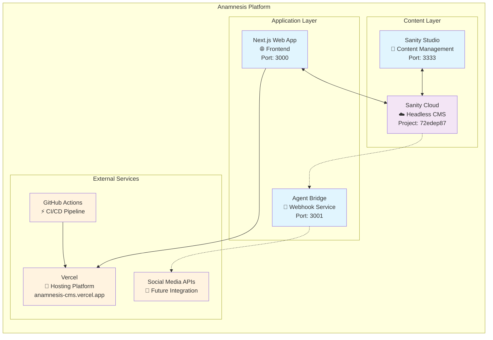

## Component Architecture

### Core Applications

```mermaid
graph LR
    subgraph "apps/web - Next.js Frontend"
        direction TB
        WEB_PAGES[Pages<br/>• Blog (/blog)<br/>• Directory (/directory)<br/>• Homepage (/)]
        WEB_API[API Routes<br/>• /api/draft<br/>• /api/disable-draft<br/>• /api/revalidate]
        WEB_COMPONENTS[Components<br/>• UI Library<br/>• Layout System<br/>• SEO Components]
        WEB_PREVIEW[Preview System<br/>• Draft Mode<br/>• Live Preview<br/>• Banner Controls]

        WEB_PAGES --> WEB_COMPONENTS
        WEB_API --> WEB_PREVIEW
    end

    subgraph "apps/cms - Sanity Studio"
        direction TB
        CMS_SCHEMAS[Content Schemas<br/>• Post<br/>• DirectoryItem<br/>• Author<br/>• SocialMedia]
        CMS_STRUCTURE[Studio Structure<br/>• 📝 Blog Section<br/>• 📂 Directory Section<br/>• 📱 Social Media]
        CMS_TEMPLATES[Templates<br/>• Directory Categories<br/>• Initial Values<br/>• Field Presets]
        CMS_PREVIEW[Preview Integration<br/>• Preview URLs<br/>• Draft Mode Toggle<br/>• Live Updates]

        CMS_SCHEMAS --> CMS_STRUCTURE
        CMS_STRUCTURE --> CMS_TEMPLATES
        CMS_STRUCTURE --> CMS_PREVIEW
    end

    subgraph "agent-bridge - Webhook Service"
        direction TB
        BRIDGE_WEBHOOKS[Webhook Handlers<br/>• Sanity Events<br/>• Social Media Docs<br/>• Signature Verification]
        BRIDGE_PROCESSING[Processing Logic<br/>• Document Filtering<br/>• JSON Logging<br/>• Future: API Calls]
        BRIDGE_SECURITY[Security Layer<br/>• HMAC Verification<br/>• CORS Protection<br/>• Request Logging]
        BRIDGE_HEALTH[Health & Monitoring<br/>• /health Endpoint<br/>• Error Handling<br/>• Status Reporting]

        BRIDGE_WEBHOOKS --> BRIDGE_PROCESSING
        BRIDGE_WEBHOOKS --> BRIDGE_SECURITY
        BRIDGE_PROCESSING --> BRIDGE_HEALTH
    end
```

### Content Management Schema

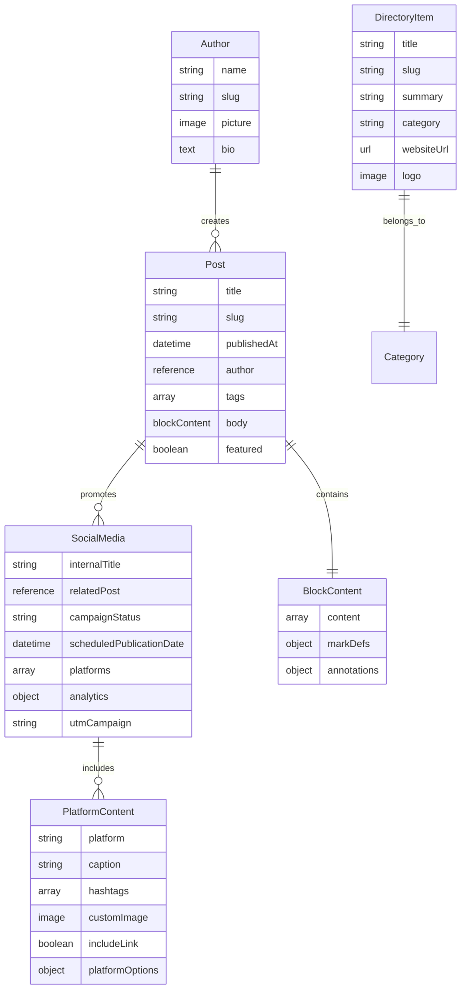

## Data Flow Diagrams

### Content Publication Flow

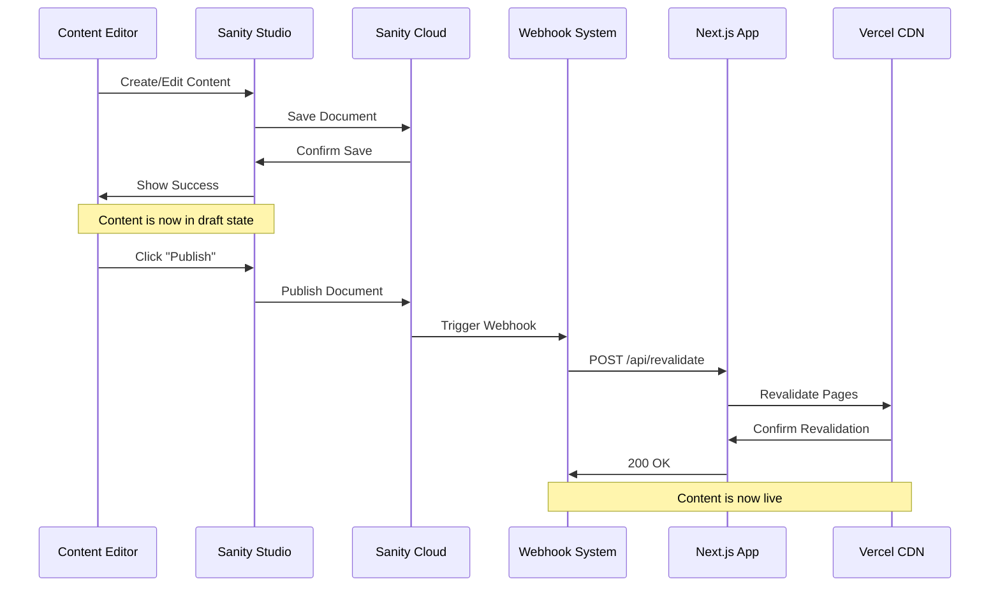

### Preview/Draft Mode Flow

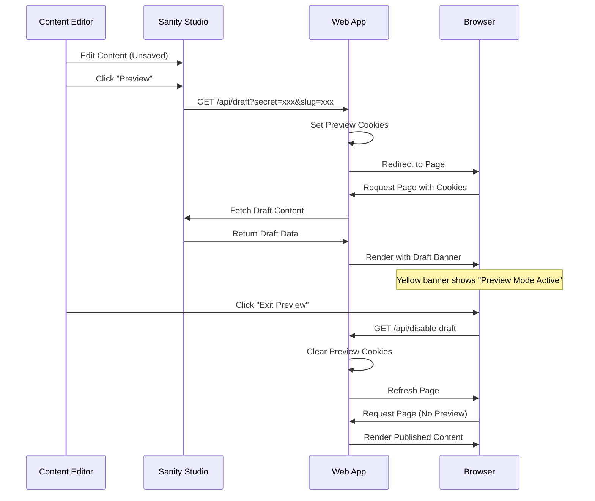

### Social Media Automation Flow

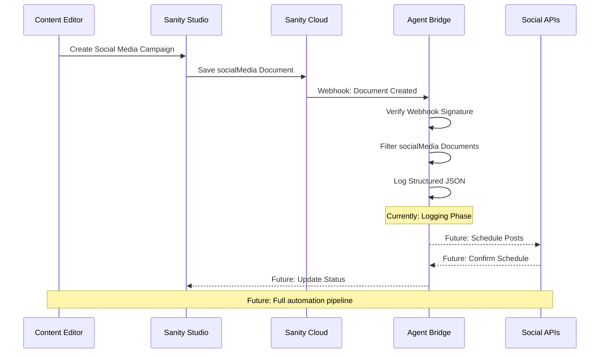

## Deployment Architecture

### Production Environment

```mermaid
graph TB
    subgraph "Development Environment"
        DEV_CODE[Local Development<br/>• Next.js (localhost:3000)<br/>• Sanity Studio (localhost:3333)<br/>• Agent Bridge (localhost:3001)]
    end

    subgraph "GitHub Repository"
        MAIN[Main Branch<br/>• Source Code<br/>• Documentation<br/>• CI/CD Workflows]
        PR[Pull Requests<br/>• Feature Branches<br/>• Code Reviews<br/>• Automated Testing]
    end

    subgraph "CI/CD Pipeline"
        ACTIONS[GitHub Actions<br/>• E2E Tests (Playwright)<br/>• Lighthouse Audits<br/>• Build Verification]
        ARTIFACTS[Test Artifacts<br/>• HTML Reports<br/>• Screenshots<br/>• Performance Metrics]
    end

    subgraph "Production Environment"
        VERCEL_PROD[Vercel Production<br/>anamnesis-cms.vercel.app<br/>• Edge Functions<br/>• CDN Distribution<br/>• Automatic Scaling]

        SANITY_PROD[Sanity Production<br/>• Content API<br/>• Media CDN<br/>• Webhook Delivery]

        BRIDGE_FUTURE[Agent Bridge<br/>Future Deployment<br/>• Webhook Processing<br/>• Social Media APIs]
    end

    %% Flow
    DEV_CODE --> MAIN
    MAIN --> PR
    PR --> ACTIONS
    ACTIONS --> ARTIFACTS
    ACTIONS --> VERCEL_PROD
    VERCEL_PROD <--> SANITY_PROD
    SANITY_PROD -.-> BRIDGE_FUTURE

    %% Styling
    classDef dev fill:#e8f5e8
    classDef ci fill:#fff3e0
    classDef prod fill:#ffebee

    class DEV_CODE dev
    class MAIN,PR,ACTIONS,ARTIFACTS ci
    class VERCEL_PROD,SANITY_PROD,BRIDGE_FUTURE prod
```

### Infrastructure Components

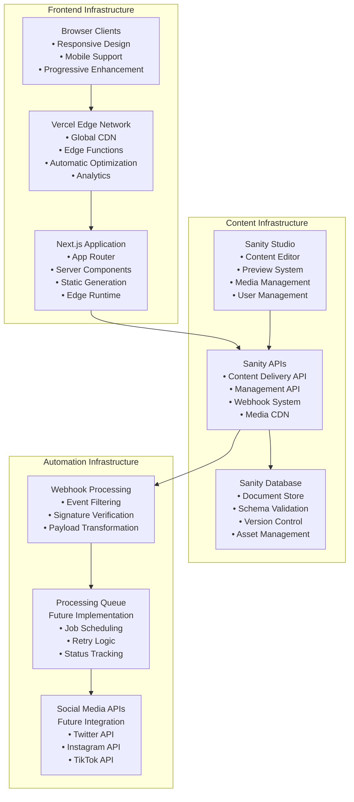

## Technology Stack

### Frontend Stack

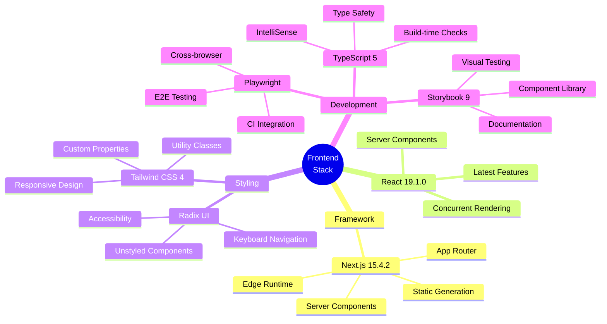

### Backend Stack

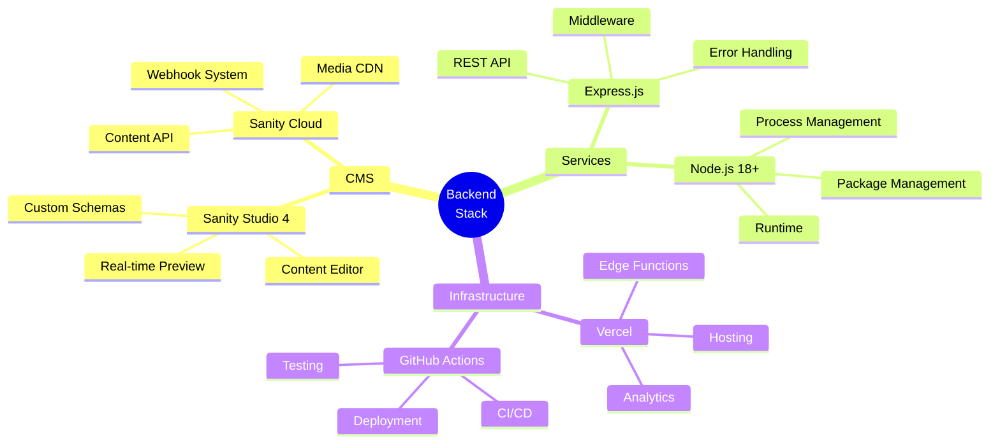

## Integration Patterns

### API Integration Patterns

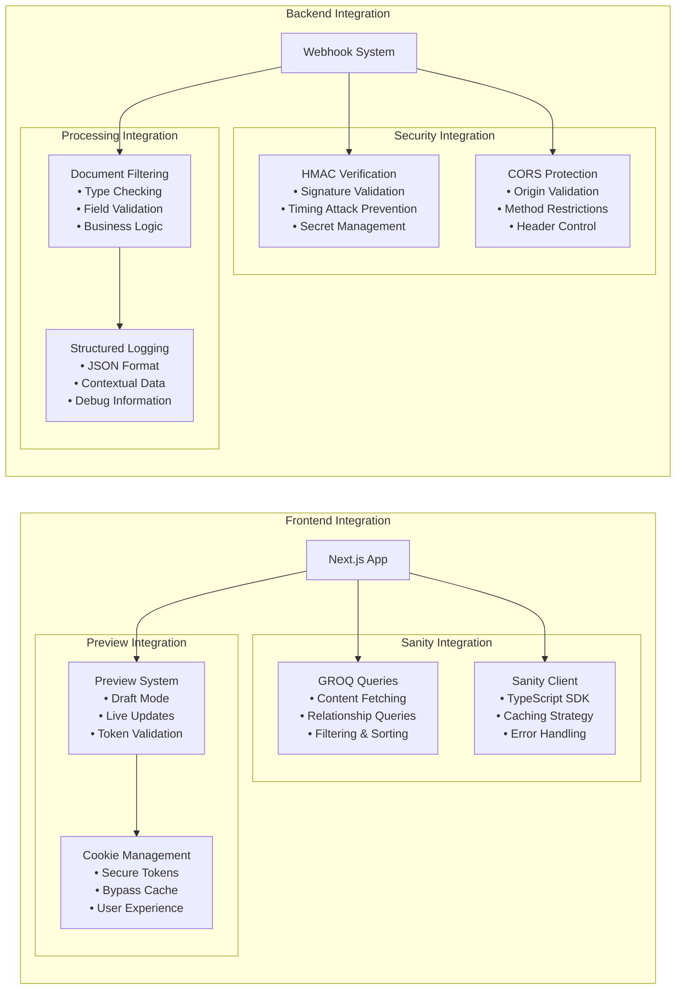

### Data Synchronization Patterns

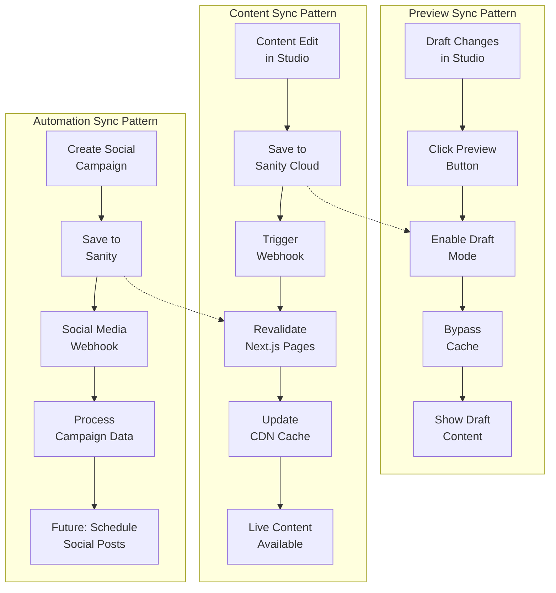

## Security Architecture

### Security Boundaries

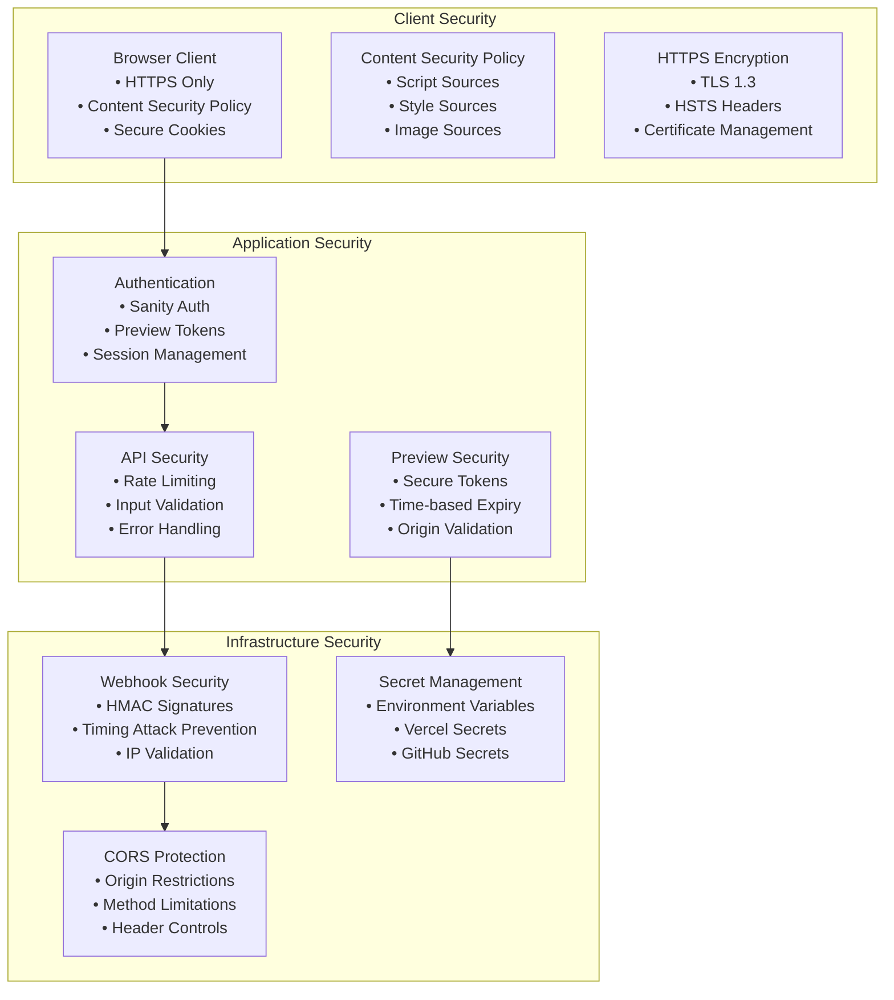

### Security Flow

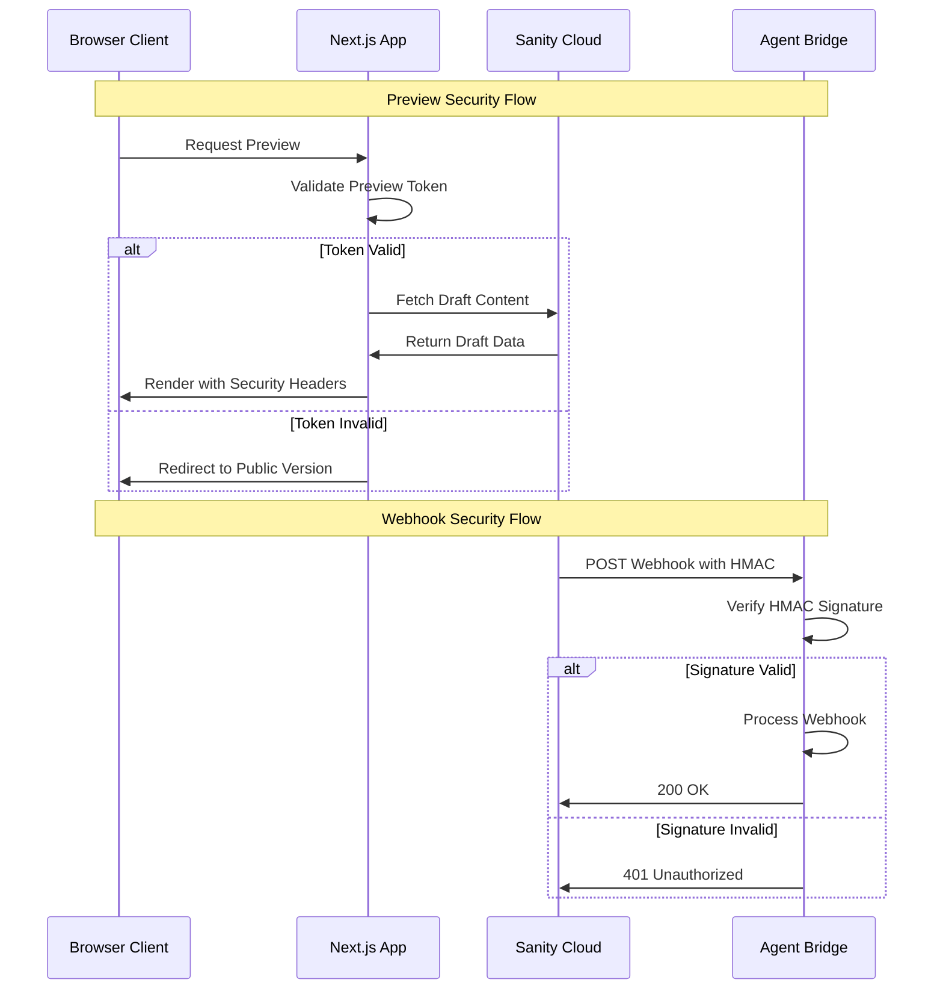

## Development Workflow

### Development Process Flow

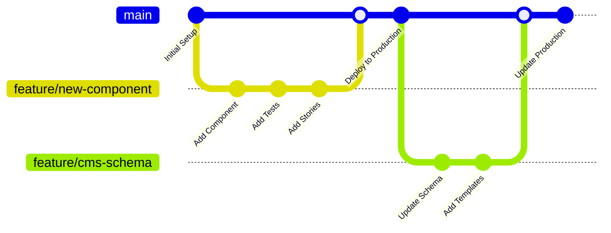

### Testing Strategy

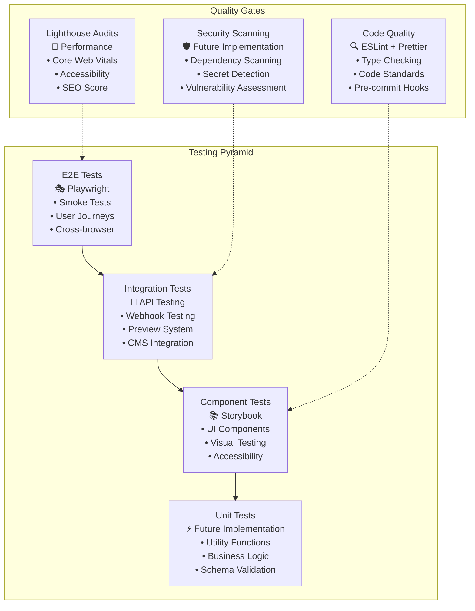

---

## System Boundaries Summary

### **Internal Boundaries**

- **Web Application**: Next.js frontend with public and preview modes
- **CMS Application**: Sanity Studio for content management
- **Agent Bridge**: Webhook processing service for automation

### **External Boundaries**

- **Sanity Cloud**: Headless CMS service with content API
- **Vercel Platform**: Hosting and CDN with edge functions
- **GitHub Actions**: CI/CD pipeline with automated testing
- **Social Media APIs**: Future integration for automated posting

### **Data Boundaries**

- **Public Data**: Published blog posts and directory items
- **Draft Data**: Unpublished content accessible via preview mode
- **Campaign Data**: Social media automation configurations
- **System Data**: Webhooks, logs, and monitoring information

This architecture provides a scalable, secure, and maintainable platform for content management and publishing, with clear separation of concerns and well-defined integration patterns.

---

_Generated: January 2025 | Last Updated: Architecture documentation for Anamnesis platform_
