# Anamnesis Platform Architecture

This document provides a comprehensive overview of the Anamnesis platform architecture, including system components, data flow, and integration patterns.

## Table of Contents

- [System Overview](#system-overview)
- [Component Architecture](#component-architecture)
- [Data Flow Diagrams](#data-flow-diagrams)
- [Deployment Architecture](#deployment-architecture)
- [Technology Stack](#technology-stack)
- [Integration Patterns](#integration-patterns)
- [Security Architecture](#security-architecture)
- [Development Workflow](#development-workflow)

## System Overview

Anamnesis is a modern content platform built as a turborepo monorepo with three primary applications working together to provide content management, web publishing, and social media automation capabilities.

```mermaid
graph TB
    subgraph "Anamnesis Platform"
        direction TB

        subgraph "Content Layer"
            CMS[Sanity Studio<br/>📝 Content Management<br/>Port: 3333]
            SANITY_CLOUD[Sanity Cloud<br/>☁️ Headless CMS<br/>Project: 72edep87]
        end

        subgraph "Application Layer"
            WEB[Next.js Web App<br/>🌐 Frontend<br/>Port: 3000]
            BRIDGE[Agent Bridge<br/>🤖 Webhook Service<br/>Port: 3001]
        end

        subgraph "External Services"
            VERCEL[Vercel<br/>🚀 Hosting Platform<br/>anamnesis-cms.vercel.app]
            GITHUB[GitHub Actions<br/>⚡ CI/CD Pipeline]
            SOCIAL[Social Media APIs<br/>📱 Future Integration]
        end
    end

    %% Connections
    CMS <--> SANITY_CLOUD
    WEB <--> SANITY_CLOUD
    SANITY_CLOUD -.-> BRIDGE
    WEB --> VERCEL
    GITHUB --> VERCEL
    BRIDGE -.-> SOCIAL

    %% Styling
    classDef app fill:#e1f5fe
    classDef service fill:#f3e5f5
    classDef external fill:#fff3e0

    class CMS,WEB,BRIDGE app
    class SANITY_CLOUD service
    class VERCEL,GITHUB,SOCIAL external
```



## Component Architecture

### Core Applications

```mermaid
graph LR
    subgraph "apps/web - Next.js Frontend"
        direction TB
        WEB_PAGES[Pages<br/>• Blog (/blog)<br/>• Directory (/directory)<br/>• Homepage (/)]
        WEB_API[API Routes<br/>• /api/draft<br/>• /api/disable-draft<br/>• /api/revalidate]
        WEB_COMPONENTS[Components<br/>• UI Library<br/>• Layout System<br/>• SEO Components]
        WEB_PREVIEW[Preview System<br/>• Draft Mode<br/>• Live Preview<br/>• Banner Controls]

        WEB_PAGES --> WEB_COMPONENTS
        WEB_API --> WEB_PREVIEW
    end

    subgraph "apps/cms - Sanity Studio"
        direction TB
        CMS_SCHEMAS[Content Schemas<br/>• Post<br/>• DirectoryItem<br/>• Author<br/>• SocialMedia]
        CMS_STRUCTURE[Studio Structure<br/>• 📝 Blog Section<br/>• 📂 Directory Section<br/>• 📱 Social Media]
        CMS_TEMPLATES[Templates<br/>• Directory Categories<br/>• Initial Values<br/>• Field Presets]
        CMS_PREVIEW[Preview Integration<br/>• Preview URLs<br/>• Draft Mode Toggle<br/>• Live Updates]

        CMS_SCHEMAS --> CMS_STRUCTURE
        CMS_STRUCTURE --> CMS_TEMPLATES
        CMS_STRUCTURE --> CMS_PREVIEW
    end

    subgraph "agent-bridge - Webhook Service"
        direction TB
        BRIDGE_WEBHOOKS[Webhook Handlers<br/>• Sanity Events<br/>• Social Media Docs<br/>• Signature Verification]
        BRIDGE_PROCESSING[Processing Logic<br/>• Document Filtering<br/>• JSON Logging<br/>• Future: API Calls]
        BRIDGE_SECURITY[Security Layer<br/>• HMAC Verification<br/>• CORS Protection<br/>• Request Logging]
        BRIDGE_HEALTH[Health & Monitoring<br/>• /health Endpoint<br/>• Error Handling<br/>• Status Reporting]

        BRIDGE_WEBHOOKS --> BRIDGE_PROCESSING
        BRIDGE_WEBHOOKS --> BRIDGE_SECURITY
        BRIDGE_PROCESSING --> BRIDGE_HEALTH
    end
```

### Content Management Schema


## Data Flow Diagrams

### Content Publication Flow


### Preview/Draft Mode Flow


### Social Media Automation Flow


## Deployment Architecture

### Production Environment

```mermaid
graph TB
    subgraph "Development Environment"
        DEV_CODE[Local Development<br/>• Next.js (localhost:3000)<br/>• Sanity Studio (localhost:3333)<br/>• Agent Bridge (localhost:3001)]
    end

    subgraph "GitHub Repository"
        MAIN[Main Branch<br/>• Source Code<br/>• Documentation<br/>• CI/CD Workflows]
        PR[Pull Requests<br/>• Feature Branches<br/>• Code Reviews<br/>• Automated Testing]
    end

    subgraph "CI/CD Pipeline"
        ACTIONS[GitHub Actions<br/>• E2E Tests (Playwright)<br/>• Lighthouse Audits<br/>• Build Verification]
        ARTIFACTS[Test Artifacts<br/>• HTML Reports<br/>• Screenshots<br/>• Performance Metrics]
    end

    subgraph "Production Environment"
        VERCEL_PROD[Vercel Production<br/>anamnesis-cms.vercel.app<br/>• Edge Functions<br/>• CDN Distribution<br/>• Automatic Scaling]

        SANITY_PROD[Sanity Production<br/>• Content API<br/>• Media CDN<br/>• Webhook Delivery]

        BRIDGE_FUTURE[Agent Bridge<br/>Future Deployment<br/>• Webhook Processing<br/>• Social Media APIs]
    end

    %% Flow
    DEV_CODE --> MAIN
    MAIN --> PR
    PR --> ACTIONS
    ACTIONS --> ARTIFACTS
    ACTIONS --> VERCEL_PROD
    VERCEL_PROD <--> SANITY_PROD
    SANITY_PROD -.-> BRIDGE_FUTURE

    %% Styling
    classDef dev fill:#e8f5e8
    classDef ci fill:#fff3e0
    classDef prod fill:#ffebee

    class DEV_CODE dev
    class MAIN,PR,ACTIONS,ARTIFACTS ci
    class VERCEL_PROD,SANITY_PROD,BRIDGE_FUTURE prod
```

### Infrastructure Components

```mermaid
graph TB
    subgraph "Frontend Infrastructure"
        direction TB
        NEXTJS[Next.js Application<br/>• App Router<br/>• Server Components<br/>• Static Generation<br/>• Edge Runtime]

        VERCEL_EDGE[Vercel Edge Network<br/>• Global CDN<br/>• Edge Functions<br/>• Automatic Optimization<br/>• Analytics]

        BROWSER[Browser Clients<br/>• Responsive Design<br/>• Mobile Support<br/>• Progressive Enhancement]
    end

    subgraph "Content Infrastructure"
        direction TB
        SANITY_STUDIO[Sanity Studio<br/>• Content Editor<br/>• Preview System<br/>• Media Management<br/>• User Management]

        SANITY_API[Sanity APIs<br/>• Content Delivery API<br/>• Management API<br/>• Webhook System<br/>• Media CDN]

        SANITY_DB[Sanity Database<br/>• Document Store<br/>• Schema Validation<br/>• Version Control<br/>• Asset Management]
    end

    subgraph "Automation Infrastructure"
        direction TB
        WEBHOOK_PROC[Webhook Processing<br/>• Event Filtering<br/>• Signature Verification<br/>• Payload Transformation]

        SOCIAL_QUEUE[Processing Queue<br/>Future Implementation<br/>• Job Scheduling<br/>• Retry Logic<br/>• Status Tracking]

        SOCIAL_APIS[Social Media APIs<br/>Future Integration<br/>• Twitter API<br/>• Instagram API<br/>• TikTok API]
    end

    %% Connections
    BROWSER --> VERCEL_EDGE
    VERCEL_EDGE --> NEXTJS
    NEXTJS --> SANITY_API
    SANITY_STUDIO --> SANITY_API
    SANITY_API --> SANITY_DB
    SANITY_API --> WEBHOOK_PROC
    WEBHOOK_PROC --> SOCIAL_QUEUE
    SOCIAL_QUEUE --> SOCIAL_APIS
```



## Technology Stack

### Frontend Stack


### Backend Stack


## Integration Patterns

### API Integration Patterns

```mermaid
graph LR
    subgraph "Frontend Integration"
        WEB_APP[Next.js App]

        subgraph "Sanity Integration"
            GROQ[GROQ Queries<br/>• Content Fetching<br/>• Relationship Queries<br/>• Filtering & Sorting]
            CLIENT[Sanity Client<br/>• TypeScript SDK<br/>• Caching Strategy<br/>• Error Handling]
        end

        subgraph "Preview Integration"
            PREVIEW[Preview System<br/>• Draft Mode<br/>• Live Updates<br/>• Token Validation]
            COOKIES[Cookie Management<br/>• Secure Tokens<br/>• Bypass Cache<br/>• User Experience]
        end
    end

    subgraph "Backend Integration"
        WEBHOOK_SYS[Webhook System]

        subgraph "Security Integration"
            HMAC[HMAC Verification<br/>• Signature Validation<br/>• Timing Attack Prevention<br/>• Secret Management]
            CORS[CORS Protection<br/>• Origin Validation<br/>• Method Restrictions<br/>• Header Control]
        end

        subgraph "Processing Integration"
            FILTER[Document Filtering<br/>• Type Checking<br/>• Field Validation<br/>• Business Logic]
            LOGGING[Structured Logging<br/>• JSON Format<br/>• Contextual Data<br/>• Debug Information]
        end
    end

    WEB_APP --> GROQ
    WEB_APP --> CLIENT
    WEB_APP --> PREVIEW
    PREVIEW --> COOKIES

    WEBHOOK_SYS --> HMAC
    WEBHOOK_SYS --> CORS
    WEBHOOK_SYS --> FILTER
    FILTER --> LOGGING
```



### Data Synchronization Patterns


## Security Architecture

### Security Boundaries

```mermaid
graph TB
    subgraph "Client Security"
        direction TB
        BROWSER[Browser Client<br/>• HTTPS Only<br/>• Content Security Policy<br/>• Secure Cookies]

        CSP[Content Security Policy<br/>• Script Sources<br/>• Style Sources<br/>• Image Sources]

        HTTPS[HTTPS Encryption<br/>• TLS 1.3<br/>• HSTS Headers<br/>• Certificate Management]
    end

    subgraph "Application Security"
        direction TB
        AUTH[Authentication<br/>• Sanity Auth<br/>• Preview Tokens<br/>• Session Management]

        API_SEC[API Security<br/>• Rate Limiting<br/>• Input Validation<br/>• Error Handling]

        PREVIEW_SEC[Preview Security<br/>• Secure Tokens<br/>• Time-based Expiry<br/>• Origin Validation]
    end

    subgraph "Infrastructure Security"
        direction TB
        WEBHOOK_SEC[Webhook Security<br/>• HMAC Signatures<br/>• Timing Attack Prevention<br/>• IP Validation]

        SECRET_MGMT[Secret Management<br/>• Environment Variables<br/>• Vercel Secrets<br/>• GitHub Secrets]

        CORS_SEC[CORS Protection<br/>• Origin Restrictions<br/>• Method Limitations<br/>• Header Controls]
    end

    BROWSER --> AUTH
    AUTH --> API_SEC
    API_SEC --> WEBHOOK_SEC
    PREVIEW_SEC --> SECRET_MGMT
    WEBHOOK_SEC --> CORS_SEC
```



### Security Flow


## Development Workflow

### Development Process Flow


### Testing Strategy

```mermaid
graph TB
    subgraph "Testing Pyramid"
        direction TB

        E2E[E2E Tests<br/>🎭 Playwright<br/>• Smoke Tests<br/>• User Journeys<br/>• Cross-browser]

        INTEGRATION[Integration Tests<br/>🔗 API Testing<br/>• Webhook Testing<br/>• Preview System<br/>• CMS Integration]

        COMPONENT[Component Tests<br/>📚 Storybook<br/>• UI Components<br/>• Visual Testing<br/>• Accessibility]

        UNIT[Unit Tests<br/>⚡ Future Implementation<br/>• Utility Functions<br/>• Business Logic<br/>• Schema Validation]
    end

    subgraph "Quality Gates"
        direction TB

        LIGHTHOUSE[Lighthouse Audits<br/>🚦 Performance<br/>• Core Web Vitals<br/>• Accessibility<br/>• SEO Score]

        LINTING[Code Quality<br/>🔍 ESLint + Prettier<br/>• Type Checking<br/>• Code Standards<br/>• Pre-commit Hooks]

        SECURITY[Security Scanning<br/>🛡️ Future Implementation<br/>• Dependency Scanning<br/>• Secret Detection<br/>• Vulnerability Assessment]
    end

    E2E --> INTEGRATION
    INTEGRATION --> COMPONENT
    COMPONENT --> UNIT

    LIGHTHOUSE -.-> E2E
    LINTING -.-> COMPONENT
    SECURITY -.-> INTEGRATION
```



---

## System Boundaries Summary

### **Internal Boundaries**

- **Web Application**: Next.js frontend with public and preview modes
- **CMS Application**: Sanity Studio for content management
- **Agent Bridge**: Webhook processing service for automation

### **External Boundaries**

- **Sanity Cloud**: Headless CMS service with content API
- **Vercel Platform**: Hosting and CDN with edge functions
- **GitHub Actions**: CI/CD pipeline with automated testing
- **Social Media APIs**: Future integration for automated posting

### **Data Boundaries**

- **Public Data**: Published blog posts and directory items
- **Draft Data**: Unpublished content accessible via preview mode
- **Campaign Data**: Social media automation configurations
- **System Data**: Webhooks, logs, and monitoring information

This architecture provides a scalable, secure, and maintainable platform for content management and publishing, with clear separation of concerns and well-defined integration patterns.

---

_Generated: January 2025 | Last Updated: Architecture documentation for Anamnesis platform_
